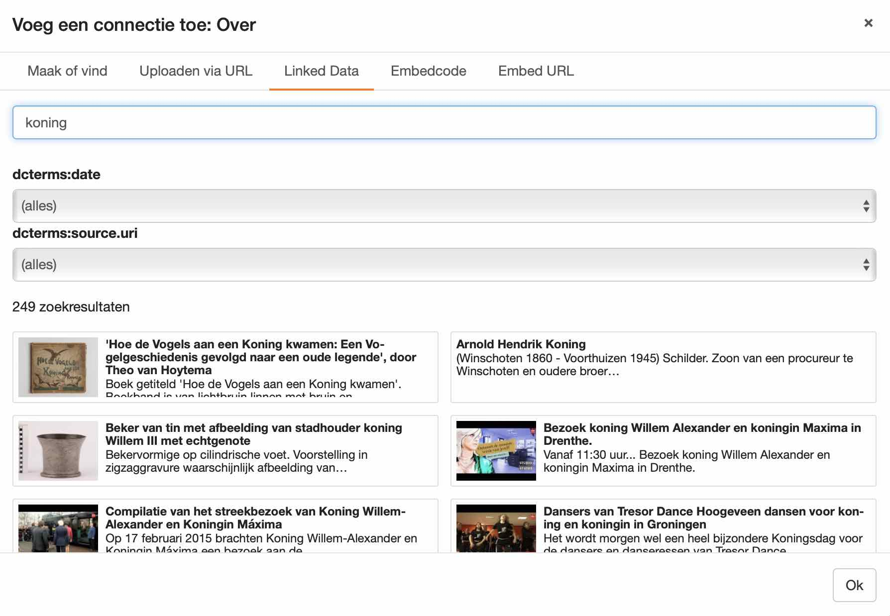

mod_ginger_rdf
==============

A Zotonic module for retrieving, working with, and producing RDF triples. This
module supports both XML and JSON-LD serialization formats.

Features:

* Make all your Zotonic resources available in RDF.
* Relate your Zotonic resources to linked data from other sources.

### Table of contents

1. [Features](#features)
   * [Represent resources in RDF](#represent-resources-in-rdf)
   * [Represent collections in RDF](#represent-collections-in-rdf)
   * [Inline JSON-LD](#inline-json-ld)
   * [Link Zotonic resources to linked data](#link-zotonic-resources-to-linked-data)
2. [Notifications](#notifications)
3. [View models](#view-models)

Features
--------

### Represent resources in RDF

Enable mod_ginger_rdf in Zotonic, then request any page with content
negotiation, using the proper Accept header to get an RDF representation of the
resource at its URI (where `123` is the id of some resource):

```bash
curl -L -H Accept:application/ld+json http://yoursite.com/id/123
curl -L -H Accept:text/turtle http://yoursite.com/id/123
```

For viewing in the browser, the JSON-LD RDF representation is also available at
`http://yoursite.com/rdf/123`.

#### Represent collections in RDF

Resource collections, including resources of the category `collection`, `query`
and their subcategories, can be represented as
[Hydra](https://www.hydra-cg.com/spec/latest/core/) collections. Hydra offers
standardized, machine-readable pagination.

```bash
curl -L -H Accept:application/ld+json http://yoursite.com/hydra/123
curl -L -H Accept:text/turtle http://yoursite.com/hydra/123
```

#### Export rules

The RDF export follows some rules.

- Only visible (published) resources return data; any invisible resource returns
  a 404.
- Only edges with visible (published) objects are included in the output.
- Only predicates that have a real URI are included in the output, so if you’re
  missing a predicate, give it the URI of some property in one of the linked
  data vocabularies (for example `http://schema.org/about`). You can do so in
  the admin, on the predicate’s edit page, under ‘Advanced’.
- The default representation uses the
  [Schema.org vocabulary](support/schema_org.erl), as
  [recommended by NDE](https://netwerk-digitaal-erfgoed.github.io/cm-implementation-guidelines/#generic-data-model).
- Vocabularies can decide to include or exclude specific predicates.

Observe the [`#rsc_to_rdf{}`](#changing-the-rdf-representation) notification to
hook into the export process.

#### JSON-LD serialization

This JSON-LD serialization happens in two steps:

1. The Zotonic resource is converted into an RDF resource, which is a set of RDF
   triples. To do so yourself:

    ```erlang
    -include_lib("mod_ginger_rdf/include/rdf.hrl").

    #rdf_resource{id = Id, triples = Triples} = m_rdf:to_triples(Id, Context).
    ```

2. The RDF resource is serialized into an Erlang map that can be fed to JSX:

    ```erlang
    -include_lib("mod_ginger_rdf/include/rdf.hrl").

    RdfResource = m_rdf:to_triples(Id, Context),
    Map = ginger_json_ld:serialize_to_map(RdfResource),
    jsx:encode(Map).
    ```

Please note that currently only the [JSON-LD](https://www.w3.org/TR/json-ld/)
serialization format is supported. Pull requests to add other formats are
very welcome.

### Inline JSON-LD

To enable rich search results,
[Google recommends](https://developers.google.com/search/docs/advanced/structured-data/intro-structured-data#structured-data-format)
embedded JSON-LD. This module
[includes an embedded JSON-LD snippet](templates/rdf/resource.tpl) in the HTML
source of each page, using the [`m.rdf` view model](#mrdf):

```html
<script type="application/ld+json">
{
    "@id": "https://example.com/id/380",
    "@type": ...
    ...
}
</script>
```

The embedded representation is identical to the content-negotiated one, so see
[there](#represent-resources-in-rdf) for more details.

You can test your pages using Google’s [Rich Result Test](https://search.google.com/test/rich-results).

### Link Zotonic resources to linked data

This module comes with a linked data tab on which editors can search for linked data
and link that to their Zotonic resources:



To show the linked data tab, first configure a linked data source:

```erlang
m_config:set_value(mod_ginger_rdf, source, <<"https://your-linked-data-source.com">>, Context).
```

Then observe the [`#rdf_search{}` notification](#finding-linked-data) to provide the tab
with search results.

Notifications
-------------

### Changing the RDF representation

Observe the `#rsc_to_rdf{}` notification to change the RDF representation of
Zotonic resources:

```erlang
-export([
    observe_rsc_to_rdf/3
]).

-include_lib("mod_ginger_rdf/include/rdf.hrl").

-spec observe_rsc_to_rdf(#rsc_to_rdf{}, [m_rdf:triple()], z:context()) -> [m_rdf:triple()].
observe_rsc_to_rdf(#rsc_to_rdf{id = Id}, Triples, Context) ->
    Triple = #triple{
        predicate = <<"http://yoursite.com/super-special-predicate">>,
        object = m_rsc:p(Id, some_custom_property, Context)
    },
    [Triple | Triples].
```

### Adding links

On `rsv_pivot_done`, the RDF module will send a `find_links` notification. You
can subscribe to this notification to enrich Zotonic resources with RDF links
to external resources. You should return a list of `#triple` records from your
observer.

```erlang
-export([
    observe_find_links/3
]).

-include_lib("mod_ginger_rdf/include/rdf.hrl").

observe_find_links(#find_links{id=Id, is_a=CatList}, Links, _Context) ->
    %% Do some search to find relevant RDF links, then return them as a list
    %% of triple records:
    [
        %% An outgoing link
        #triple{
            type=resource,
            subject=Id,
            predicate="http://xmlns.com/foaf/0.1/depiction",
            object="http://example.com/some/external/resource.rdf"
        },

        %% An incoming link
        #triple{
            type=resource,
            subject="http://example.com/some/external/resource.rdf",
            predicate="http://xmlns.com/foaf/0.1/depicts",
            object=Id
        }
    | Links ].
```

The mod_ginger_rdf module will then:

* for each RDF resource (subject or object), create a non-authoritative
  Zotonic resource containing the RDF resource URL
* for each RDF link, create an edge between these non-authoritative resources
  and authoritative Zotonic resources.

If the URLs point to real linked data sources, the URL should be sufficient
for further data retrieval. Unfortunately, this is not always the case, so you
may want to store additional properties in either subject or object by adding
`subject_props` or `object_props`:


```erlang
        #triple{
            type=resource,
            subject=Id,
            predicate="http://xmlns.com/foaf/0.1/depiction",
            object="http://example.com/some/external/resource.rdf",
            object_props=[
                {some_extra_id_that_is_needed_for_retrieval, "ID.123.467"}
            ]
        },
```

### On-demand linked data retrieval

On `rsc_get` this module will send a `rdf_get` notification for all
non-authoritative resources that have a URI.

Observe this notification to dynamically retrieve RDF from external data
sources:

```erlang
-export([
    observe_rdf_get/3
]).

%% Props is the set of
observe_rdf_get(#rdf_get{uri=Uri}, Props, _Context) ->
    RdfProperties = do_http_request(Uri),

    %% Return the original (Zotonic) resource properties combined with the
    %% dynamically fetched linked data.
    Props ++ RdfProperties.
```

You can then render the RDF properties in a template:

```dtl
<p>Creator: {{ m.rsc[id]['dc:creator'] }}</p>
<p>Description: {{ m.rsc[id]['dc:description'] }}</p>
```

### Finding linked data

Observe the `#rdf_search{}` notification to provide the
[linked data tab](#link-zotonic-resources-to-linked-data) with search results:

```erlang
-include_lib("mod_ginger_rdf/include/rdf.hrl").

observe_rdf_search(#rdf_search{source = Source, query = #search_query{search = {rdf, Args}, offsetlimit = {Limit, Length}}}) ->
    %% retrieve results from your linked data source.
```

View models
-----------

### m.rdf

To render dynamically retrieved RDF data in your templates:

```dtl
{{ m.rdf[id]['http://purl.org/dc/elements/1.1/title'] }}
```

You can also use certain shortcuts to namespaced RDF properties. For instance:

```dtl
{{ m.rdf[id].thumbnail }}
```

looks at `foaf:thumbnail` first, then `edm:isShownBy`, `schema:image` and
`edm:object` to try to find a suitable value.

Print a full RDF representation of a Zotonic resource:

```dtl
{{ m.rdf[id] }}
```
